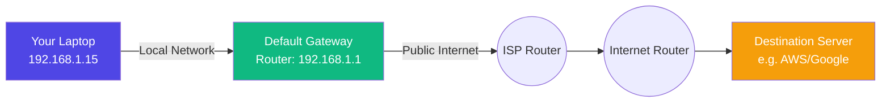

*Video Reference:* [YouTube](https://www.youtube.com/watch?v=Ik-buVzjW3s)

In the previous chapter, we learned how your computer uses a **Subnet Mask** to determine if a destination IP address belongs to the same local network. 

If the destination is on the same network, your laptop sends the data directly. But what happens if the subnet mask test fails? What if you are trying to reach a server in another country, and your computer realizes the destination is entirely outside of its local network?

Your computer is incredibly smart, but it has no idea how the global internet is wired. It doesn't know the path to Google's servers, and it doesn't know where AWS is hosted.

So, how does the data get there? This is where the **Default Gateway** steps in.

### What is a Default Gateway?

Simply put, the **Default Gateway** is the exit door of your local network. 

In a standard home or office setup, your Default Gateway is your **Router**. It is the one designated device in your entire network that actually knows how to talk to the outside world (the public internet).

### Passing the Parcel

When your laptop wants to load a website, it asks a DNS server for the IP address (as we discussed in Chapter 1). Once it has the IP, it checks its Subnet Mask and realizes, *"This IP is not on my local network."*

Because your laptop doesn't know how to reach the public internet itself, it blindly forwards the data packet to the Default Gateway. 

It essentially hands the packet to the router and says: *"Hey, I have no idea where this IP address is, but I'm assuming you do. Please deliver this for me."*

Once the router receives the packet, it takes over. It looks at the destination IP and forwards the packet to another router at your Internet Service Provider (ISP). That router forwards it to another router, and another, hopping across the world until the data finally reaches the destination device.

### How Does Your Computer Know Where the Gateway Is?

You might be wondering: If your computer doesn't know how the internet works, how does it know the IP address of its Default Gateway?

It doesn't have to guess! When you connect your laptop or phone to a Wi-Fi network, a protocol called **DHCP** (which we briefly mentioned in Chapter 3) assigns your device its IP address. Along with that IP address, DHCP also hands your device a small configuration file that explicitly states: *"If you ever need to reach a network outside of this one, send your data to THIS specific IP address."*

That IP address is your router's local IP (often something like `192.168.1.1`). 

### Summary

There is no need to overthink it. **The Default Gateway is simply the device that knows how to connect to outside networks.** If you want to communicate with a machine that is not on your local network, you must go through the Default Gateway.
