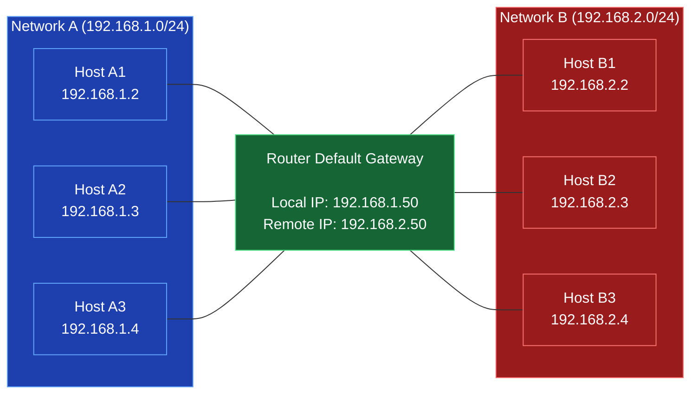
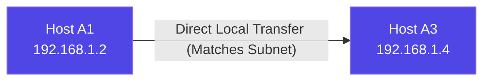
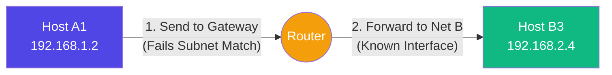

*Video Reference:* [YouTube](https://www.youtube.com/watch?v=PqdrgoYb3Vc)

Over the past few chapters, we have explored the fundamental building blocks of networking: the structure of an IP address, the role of a Subnet Mask, and the purpose of a Default Gateway. 

If you haven't read those chapters yet, I highly recommend going back and reading them first. In this chapter, we are going to apply everything we've learned so far to see how it all works together in action!

## Routing Example Setup: Two Distinct Networks

To understand practical routing, let's look at a network setup consisting of two separate subnets connected by a single Router.

Notice that our Router sits in the middle. A router can have **multiple network interfaces** (physical ethernet ports). In this scenario, one interface is plugged into Network A, and another interface is plugged into Network B. Because the router is physically connected to both, it is fully aware of how to reach devices in either network.

> **📝 Note:** Is my home router *only* part of my local network?
>
>No! If it were only part of your local network, you would never be able to reach the internet. A router is a bridge between two different networks. It has one interface (your LAN ports and Wi-Fi) plugged into your local network with a local IP, and a completely separate interface (the WAN port) plugged into your ISP's network with a public IP. It is a member of **both** networks simultaneously, which is exactly how it is able to pass data between them!

Now, let's explore two different communication scenarios.

## Scenario 1: Communicating on the Same Network

**Goal:** Host A1 wants to send data to Host A3.

1. **The Subnet Check:** Host A1 takes its own IP (`192.168.1.2`) and applies its subnet mask (`255.255.255.0`). The result is the Network ID: `192.168.1.0`.
2. **The Destination Check:** Host A1 then takes the destination IP (`192.168.1.4`) and applies the same subnet mask. The result is also `192.168.1.0`.
3. **The Result:** The Network IDs match perfectly! 

Because the IDs match, Host A1 instantly knows that Host A3 is sitting on the exact same local network. Host A1 does **not** need to send this data to the Default Gateway. Instead, it sends the data directly across the local switch to A3.

## Scenario 2: Communicating Across Different Networks

**Goal:** Host A1 wants to send data to Host B3.

1. **The Subnet Check:** Host A1 calculates its own Network ID (`192.168.1.0`).
2. **The Destination Check:** Host A1 applies its subnet mask to Host B3's IP (`192.168.2.4`). The resulting Network ID is `192.168.2.0`.
3. **The Result:** The Network IDs **do not match** (`192.168.1.0` ≠ `192.168.2.0`).

Host A1 realizes that Host B3 is on a completely different network. Host A1 has no idea how to reach Network B. 

So, what does it do? It relies on its **Default Gateway**!

Host A1 packages up the data and sends it directly to the Router, essentially saying: *"I don't know where 192.168.2.4 is, please handle this for me."*

Once the Router receives the packet, it looks at the destination IP. Because the Router has a network interface physically plugged into Network B, it says: *"Oh, I know where the 192.168.2.0 network is, it's plugged into my second port!"* 

The Router then forwards the packet directly to Host B3.

## Next: MAC Addresses and the OSI Model

This chapter serves as a high-level summary of everything we've built so far. We've proven how IP addresses, subnet masks, and default gateways all collaborate to ensure your data always finds its destination.

However, we glossed over some deeply technical magic. When Host A1 sends data to the Router, or when it sends data locally to Host A3, how do the physical electrical signals actually find the right hardware chip? 

To understand that, we need to dive under the hood. In the upcoming chapters, we will explore **MAC Addresses**, the **OSI Model**, **Network Switches**, and how the **Address Resolution Protocol (ARP)** binds it all together!
