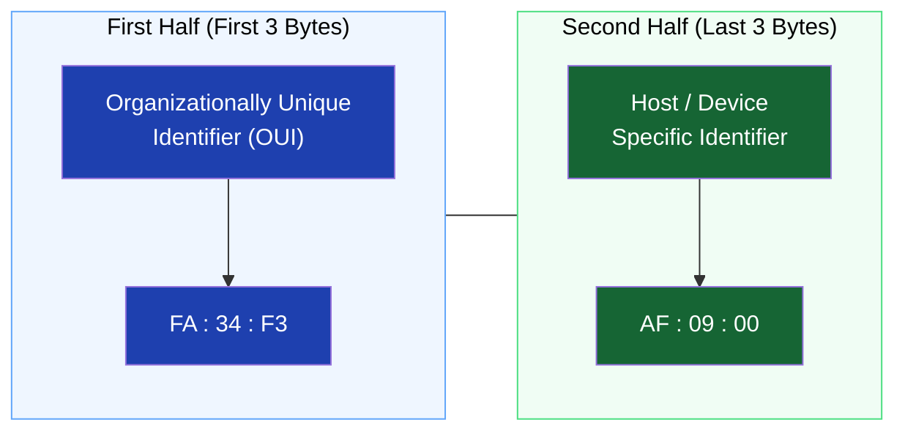

*Inspired by:* [YouTube](https://www.youtube.com/watch?v=jKWlJPpkp9o)

In previous chapters, we looked at IP addresses, subnet masks, and routers - all of which help us route data across local and remote networks. But there's a crucial piece of the puzzle we've glossed over: how do electrical signals actually find the right physical hardware chip? 

To answer that, we need to talk about **MAC Addresses**.

## What is a Network Interface?

Before understanding MAC addresses, we need to understand what they are attached to: a **Network Interface**.

Your laptop, router, or mobile phone communicates with other devices using a network interface. This is the physical piece of hardware that transmits and receives signals (wired or wirelessly). Examples include:
- **Network Interface Card (NIC):** The integrated circuit board with antennas for Wi-Fi.
- **Ethernet Port:** The physical port that deals with electrical signals over cables.
- **Bluetooth Adapter:** A short-range network interface.

Because these are actual, physical pieces of hardware, we need a permanent way to address them.

## Why do we need a MAC Address if we have an IP Address?

You might be wondering: *If my laptop already has an IP address, why does it need another address?*

The answer comes down to **Virtual vs. Physical**:

- **IP Addresses are Virtual:** They can change. If you connect your laptop to your home Wi-Fi, it might get the IP `192.168.1.4`. If you disconnect, go to the office, and connect to a different network, or even come back home later, your IP address might change. IP is not a reliable way to permanently identify a specific piece of hardware.
- **MAC Addresses are Physical:** MAC stands for **Media Access Control**. This address is unique to the physical device and *never* changes. It is permanently burned or engraved onto the network interface by the manufacturer. 

When you send a data packet from Host A to Host B on a local network, knowing the IP address isn't enough. The physical electrical signals need the exact physical MAC address of the destination device's hardware to successfully deliver the data!

## The Structure of a MAC Address

So, what does a MAC address look like?

Unlike an IP address which is written in standard decimal numbers (like `192.168.1.1`), a MAC address is written in **Hexadecimal**.

### Hexadecimal Basics
While standard decimal numbers go from 0 to 9, hexadecimal numbers go from 0 to 15. Because we can't use two digits to represent a single number in hex (like `10`), we use letters! 
Hexadecimal numbers are: `0, 1, 2, 3, 4, 5, 6, 7, 8, 9, A, B, C, D, E, F`.

### Size and Formatting
A MAC address is exactly **48 bits** long, which equals **6 bytes** (since 1 byte = 8 bits). 

It is typically written as a set of six two-digit hexadecimal numbers, separated by either colons (`:`) or hyphens (`-`). 
- **Mac/Linux Format:** `FA:34:F3:AF:09:00`
- **Windows Format:** `FA-34-F3-AF-09-00`

Each of these six pairs represents exactly 1 byte. 

## The Two Halves of a MAC Address

A 6-byte MAC address isn't just a random string of characters; it's logically split perfectly in half:

1. **First 3 Bytes (OUI):** This stands for **Organizationally Unique Identifier**. When companies like Cisco, Intel, or Apple manufacture a network interface, they are assigned specific 3-byte codes. Every device made by that manufacturer will start with their specific OUI.
2. **Last 3 Bytes (Host):** The remaining 3 bytes are assigned uniquely by the manufacturer to that exact physical piece of hardware. Even if two Intel network cards share the same first 3 bytes, their last 3 bytes will be completely different.

Just like an IP address is split into a Network ID and a Host ID, a MAC address is split into a Manufacturer ID (OUI) and a Device ID!

## Finding Your Own MAC Address

Curious what your device's MAC address looks like? You can easily find it using your computer's terminal:
- **Windows:** Open Command Prompt and type `ipconfig /all`. Look for the "Physical Address".
- **Mac/Linux:** Open your Terminal and type `ifconfig` (or `ip link` on newer Linux distros). Look for the `ether` or `HWaddr` value.

## Next Steps
As a developer, you might not interact directly with MAC addresses every day. However, having a mental model of how physical hardware is addressed is crucial for understanding the OSI model, switches, and routing.

