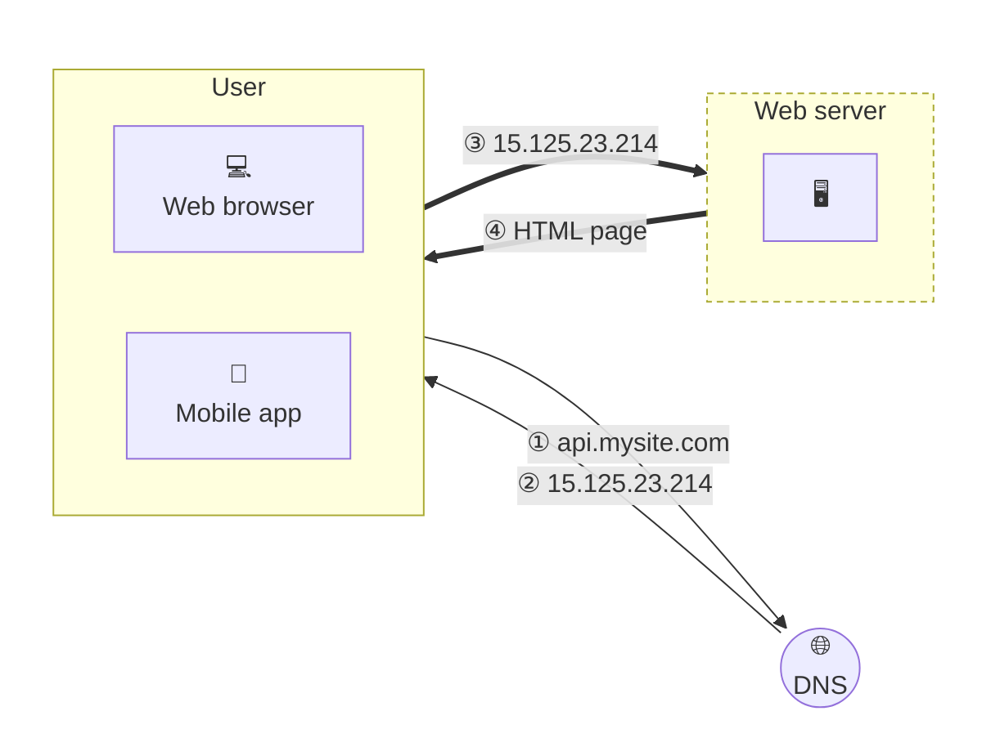

Notes from Chapter 1 of *System Design Interview* by Alex Xu: "Scale From Zero to Millions of Users." This chapter is long enough to split into several posts; this one covers the starting point, single server setup.

A journey of a thousand miles begins with a single step, and building a complex system is no different. To start with something simple, everything is running on a single server: web app, database, cache, etc.

## Single server setup

To understand this setup, it is helpful to investigate the request flow and traffic source. Let us first look at the request flow (Figure 1-2):



*Figure 1-2*

1. Users access websites through domain names, such as `api.mysite.com`. Usually, the Domain Name System (DNS) is a paid service provided by 3rd parties and not hosted by our servers.
2. Internet Protocol (IP) address is returned to the browser or mobile app. In the example, IP address `15.125.23.214` is returned.
3. Once the IP address is obtained, Hypertext Transfer Protocol (HTTP) requests are sent directly to your web server.
4. The web server returns HTML pages or JSON response for rendering.

Next, let us examine the traffic source. The traffic to your web server comes from two sources: web application and mobile application.

- **Web application:** it uses a combination of server-side languages (Java, Python, etc.) to handle business logic, storage, etc., and client-side languages (HTML and JavaScript) for presentation.
- **Mobile application:** HTTP protocol is the communication protocol between the mobile app and the web server. JavaScript Object Notation (JSON) is commonly used API response format to transfer data due to its simplicity. An example of the API response in JSON format is shown below:

```
GET /users/12 – Retrieve user object for id = 12
```

With the growth of the user base, one server is not enough, and we need multiple servers: one for web/mobile traffic, the other for the database. Separating web/mobile traffic (web tier) and database (data tier) servers allows them to be scaled independently.

That's where the next post picks up.
