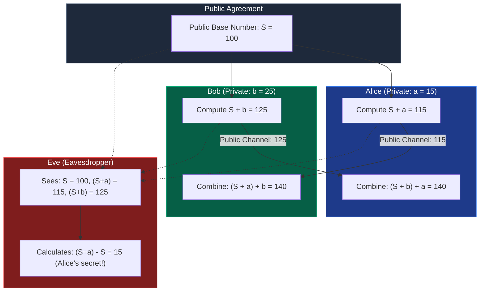
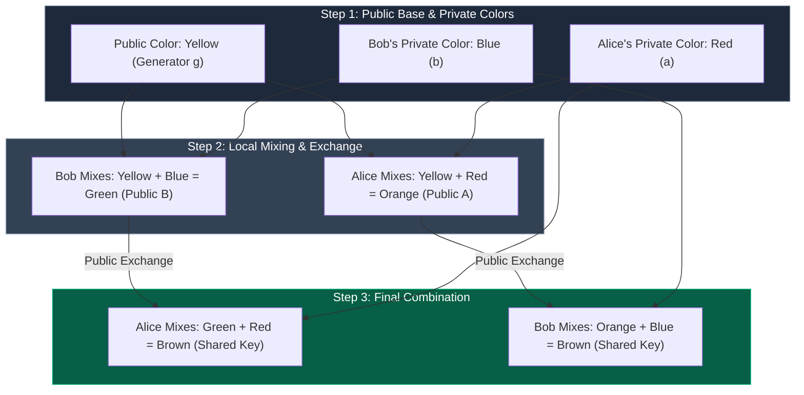
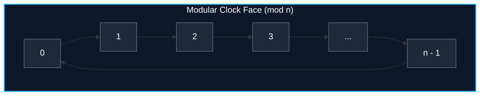
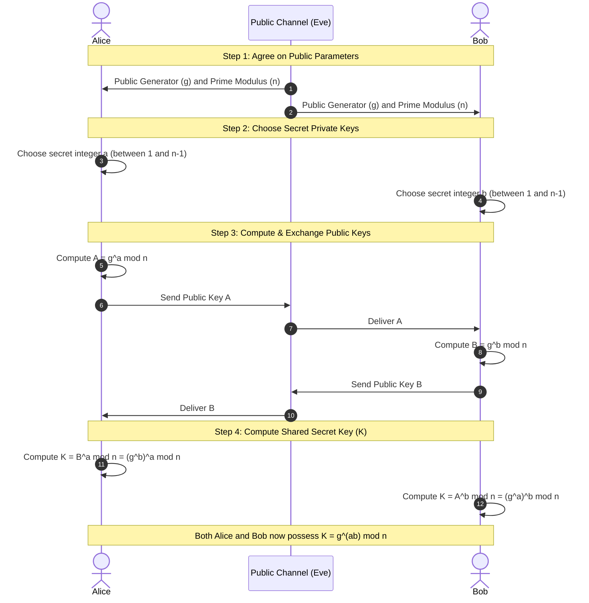

*Inspired by:*
- [Computerphile: Diffie-Hellman Key Exchange Intuition](https://www.youtube.com/watch?v=85oMrKd8afY)
- [Computerphile: Color Mixing Analogy with Dr. Mike Pound](https://www.youtube.com/watch?v=NmM9HA2MQGI)
- [Computerphile: Diffie-Hellman Maths with Dr. Mike Pound](https://www.youtube.com/watch?v=Yjrfm_oRO0w)

Whenever two devices communicate securely over the internet (such as your phone connecting to a web server over HTTPS), they use **symmetric key cryptography**. Symmetric encryption requires both parties to possess the exact same secret key to encrypt and decrypt messages. 

However, a fundamental dilemma arises: **how can two parties establish a shared secret key over an untrusted, public network without exposing the key to eavesdroppers?**

Published in 1976 by Whitfield Diffie and Martin Hellman, the **Diffie-Hellman Key Exchange** protocol solves this exact problem. It allows two participants to jointly generate a shared secret key over an insecure medium without ever transmitting the secret key itself.

In this post, we will explore the fundamental intuition behind key agreement, analyze why simple arithmetic fails, walk through the famous color mixing analogy, examine the underlying modular arithmetic and discrete logarithm problem, and work through a complete mathematical example step by step.

---

## The Key Distribution Problem and the Naive Addition Approach

Suppose Alice and Bob want to establish a secret key over a public network monitored by an eavesdropper, Eve.

If Alice simply picks a secret number **K** and sends it to Bob over the network, Eve intercepts **K** immediately. To prevent this, Alice and Bob must independently contribute secret information and combine them to derive the same final value.

### Why Addition Fails (The Inversion Flaw)

To understand why Diffie-Hellman requires specialized mathematical operations, consider a naive attempt using standard addition:

1. Alice and Bob publicly agree on a starting public number, **S = 100**.
2. Alice picks a secret number, **a = 15**. Bob picks a secret number, **b = 25**.
3. Alice computes `S + a = 100 + 15 = 115` and sends `115` to Bob.
4. Bob computes `S + b = 100 + 25 = 125` and sends `125` to Alice.
5. Alice takes Bob's received value (`125`) and adds her secret **a**: `125 + 15 = 140`.
6. Bob takes Alice's received value (`115`) and adds his secret **b**: `115 + 25 = 140`.

Both Alice and Bob arrive at the shared sum **140** because addition is commutative (`a + b = b + a`). However, **addition is easily invertible through subtraction**. 

Eve intercepts **S = 100** and Alice's transmission **115**. Eve simply calculates `115 - 100 = 15` to uncover Alice's secret **a**.

For key exchange to be secure, we need a mathematical operation that is easy to compute in the forward direction, but computationally infeasible to invert.

---

## Conceptual Mental Model: The Color Mixing Analogy

Before diving into the equations, Dr. Mike Pound presents an intuitive physical analogy using paint mixing:

Imagine that mixing two paint colors together is a **one-way operation**. Once two paints are blended into a new color, it is practically impossible to separate them back into their original constituent pigments.

1. **Public Agreement**: Alice and Bob agree publicly on a starting base color, **Yellow**.
2. **Private Choice**: Alice picks a secret color (**Red**). Bob picks a secret color (**Blue**). Neither reveals their secret color to anyone.
3. **Primary Mixture**:
   - Alice mixes Yellow + Red to get **Orange**.
   - Bob mixes Yellow + Blue to get **Green**.
4. **Public Exchange**: Alice sends her **Orange** mixture to Bob over the public channel. Bob sends his **Green** mixture to Alice over the public channel.
5. **Final Combination**:
   - Alice takes Bob's **Green** mixture and adds her secret **Red**, producing **Brown**.
   - Bob takes Alice's **Orange** mixture and adds his secret **Blue**, producing **Brown**.

Both end up with the identical composite color (Yellow + Red + Blue = Brown). 

An eavesdropper on the network sees Yellow, Orange, and Green. However, because paint un-mixing is impossible, the eavesdropper cannot extract Red or Blue from Orange or Green. Furthermore, combining the public mixtures (Orange + Green) yields Yellow + Yellow + Red + Blue, which contains extra Yellow and does not match the secret key.

---

## The Mathematics of Diffie-Hellman

In cryptography, we replace paint mixing with **modular exponentiation** over a finite cyclic group.

### Modular Arithmetic and the Clock Face Model

The modulo operation (`mod n`) yields the remainder after division by **n**. A helpful way to visualize modular arithmetic is a **clock face** numbered from `0` to `n - 1`.

When performing exponentiation modulo **n**:

> **y = g^x (mod n)**

As exponent **x** increases, the value wraps around the clock face repeatedly, landing on a final remainder **y** between `0` and `n - 1`.

### Efficient Computation: Step-by-Step Modulo Reduction

Calculating `g^x` directly for large exponents causes arithmetic overflow because the number grows exponentially. However, modular arithmetic satisfies the multiplication rule:

> **(A × B) mod n = [ (A mod n) × (B mod n) ] mod n**

This property allows us to apply the modulo operation at each multiplication step, keeping intermediate numbers small (always bounded below **n**) while producing the exact same final remainder.

### The Discrete Logarithm Problem (The One-Way Trapdoor Function)

The security of Diffie-Hellman relies on the asymmetric computational complexity of modular exponentiation:

1. **Easy Direction (Forward)**: Given base **g**, exponent **x**, and modulus **n**, computing `y = g^x (mod n)` is computationally fast (using binary exponentiation / square-and-multiply algorithms).
2. **Hard Direction (Inverse)**: Given base **g**, result **y**, and modulus **n**, finding the secret exponent **x** such that `g^x ≡ y (mod n)` is known as the **Discrete Logarithm Problem**.

Knowing the final position **y** on the clock face gives no clue as to how many full rotations around the clock were completed. There is no known efficient general algorithm to compute discrete logarithms for large prime moduli. An attacker must perform an exhaustive brute-force search over an astronomically large search space.

---

## The Complete Diffie-Hellman Protocol

Here is the step-by-step mathematical flow of the Diffie-Hellman protocol:

### Mathematical Proof of Key Equality

Alice computes her key using Bob's public value **B**:

> **K_Alice = B^a (mod n) = (g^b mod n)^a (mod n) = g^(ba) (mod n)**

Bob computes his key using Alice's public value **A**:

> **K_Bob = A^b (mod n) = (g^a mod n)^b (mod n) = g^(ab) (mod n)**

Because exponentiation operations commute (`ba = ab`):

> **K_Alice = K_Bob = g^(ab) (mod n)**

---

## Step-by-Step Numerical Walkthrough

Let us trace the protocol using small concrete numbers:

- **Public Generator**: `g = 3`
- **Public Prime Modulus**: `n = 19`
- **Alice's Private Secret**: `a = 4`
- **Bob's Private Secret**: `b = 5`

### Step 1: Public Key Generation

**Alice computes public key A**:
> **A = g^a mod n = 3^4 mod 19 = 81 mod 19 = 5**

**Bob computes public key B**:
> **B = g^b mod n = 3^5 mod 19 = 243 mod 19 = 15**

Alice sends `A = 5` to Bob; Bob sends `B = 15` to Alice over the public channel.

### Step 2: Shared Secret Derivation

**Alice computes shared key K using B = 15 and a = 4**:
> **K = B^a mod n = 15^4 mod 19**

We simplify using modular reduction:
- `15^2 = 225 = (11 × 19) + 16 ≡ 16 (mod 19)`
- `15^4 = (15^2)^2 ≡ 16^2 = 256 = (13 × 19) + 9 ≡ 9 (mod 19)`

Alice derives shared secret **K = 9**.

**Bob computes shared key K using A = 5 and b = 5**:
> **K = A^b mod n = 5^5 mod 19**

We simplify using modular reduction:
- `5^2 = 25 ≡ 6 (mod 19)`
- `5^4 = (5^2)^2 ≡ 6^2 = 36 ≡ 17 (mod 19)`
- `5^5 = 5^4 × 5 ≡ 17 × 5 = 85 = (4 × 19) + 9 ≡ 9 (mod 19)`

Bob derives shared secret **K = 9**.

Both Alice and Bob independently arrive at the exact same key, **K = 9**, without revealing `a = 4` or `b = 5` publicly.

---

## Cryptographic Requirements and Edge Cases

For Diffie-Hellman to be cryptographically secure in practice, specific conditions must be enforced on parameter selection.

### 1. Modulus n Must Be a Very Large Prime

- **Key Size**: In modern applications, **n** must be a prime number of at least 2048 bits (4096 bits is standard for high-security environments).
- **Why Primes?**: If **n** is a composite number with small prime factors, specialized mathematical attacks (such as the Pohlig-Hellman algorithm) decompose the discrete logarithm problem into smaller sub-problems, allowing attackers to solve it rapidly.

### 2. Generator g Must Be a Primitive Root Modulo n

The base **g** must be a **primitive root modulo n**. This guarantees that the powers of `g^x (mod n)` generate all possible integers in the range `1, 2, ..., n - 1`.

To see why generator choice matters, consider modulus **n = 19**:

- **Bad Choice (g = 1)**:
  > **1^x (mod 19) = 1 (for all x)**  
  The shared key will always be `1`, giving zero security.

- **Suboptimal Choice (g = 4)**:
  Evaluating powers of `4 (mod 19)`:
  > **4^1 = 4, 4^2 = 16, 4^3 = 7, 4^4 = 9, 4^5 = 17, 4^6 = 11, 4^7 = 6, 4^8 = 5, 4^9 = 1 (mod 19)**  
  Notice that `4^x (mod 19)` only generates a small subgroup of size 9 (`1, 4, 5, 6, 7, 9, 11, 16, 17`). Half of the possible remainders are completely skipped, reducing the search space for an attacker.

- **Good Choice (g = 3, Primitive Root Modulo 19)**:
  Evaluating powers of `3 (mod 19)`:
  > **3^1 = 3, 3^2 = 9, 3^3 = 8, 3^4 = 5, 3^5 = 15, 3^6 = 7, 3^7 = 2, 3^8 = 6, 3^9 = 18, 3^10 = 16 ... (mod 19)**  
  Powers of 3 cycle through all 18 non-zero remainders from `1` to `18`. This maximizes entropy and ensures the attacker cannot eliminate any candidate keys.

---

## Practical Deployment and Symmetric Key Derivation

Is the output `K = g^(ab) (mod n)` used directly as an encryption key for data payloads?

In practical protocol implementations (such as TLS 1.3, SSH, and IPsec):
1. Diffie-Hellman establishes the raw shared secret integer **K**.
2. This secret **K** is fed into a **Key Derivation Function (KDF)** or cryptographic hash function (such as HKDF or SHA-256).
3. The KDF outputs uniformly distributed, fixed-length symmetric keys used to encrypt traffic via algorithms like AES-256-GCM or ChaCha20-Poly1305.
