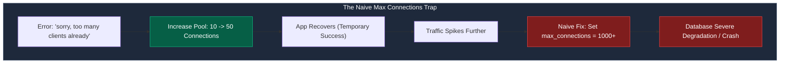
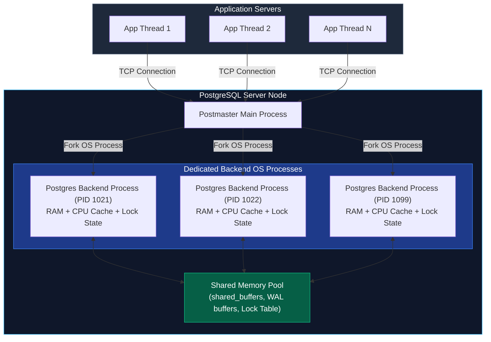
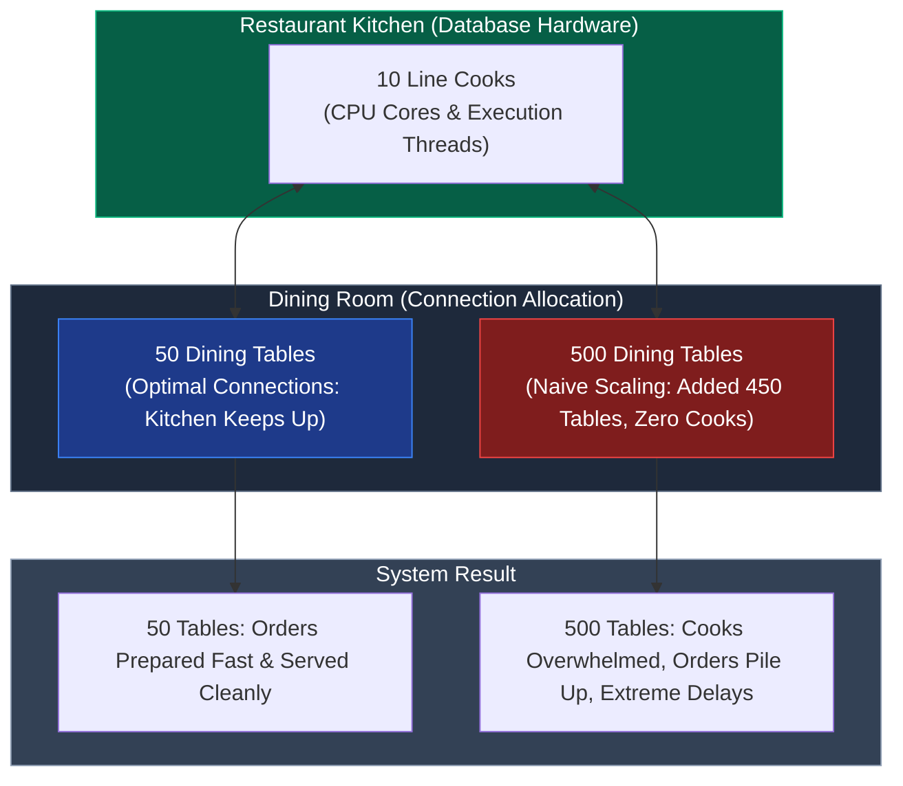
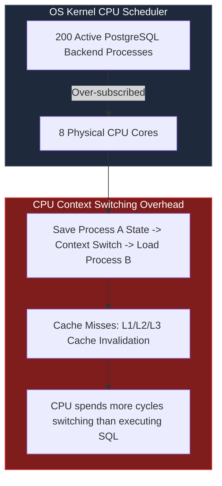
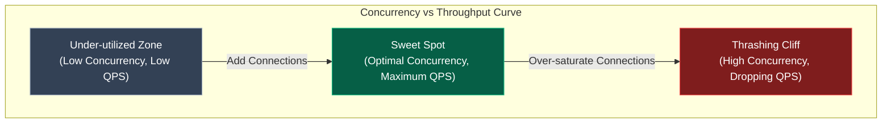
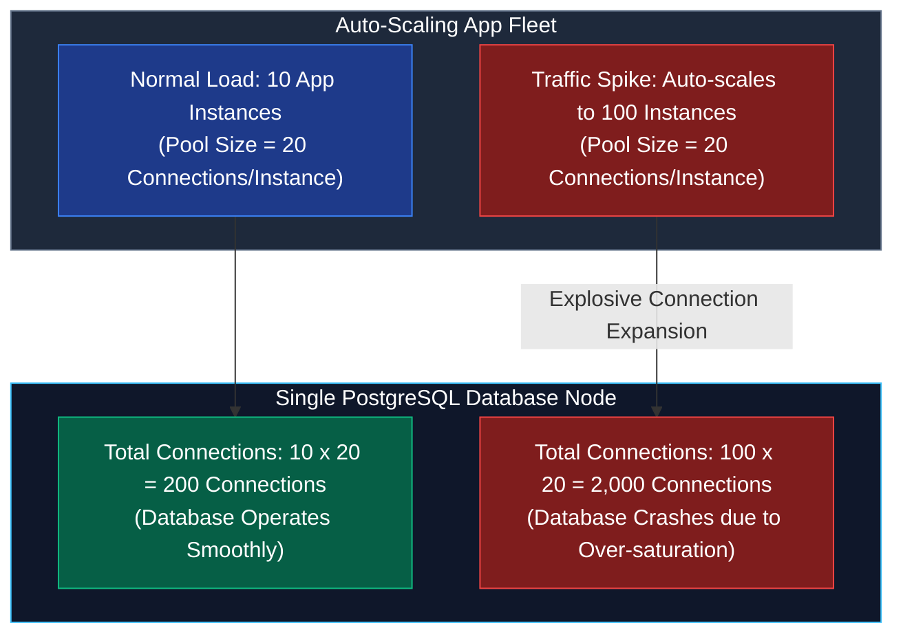
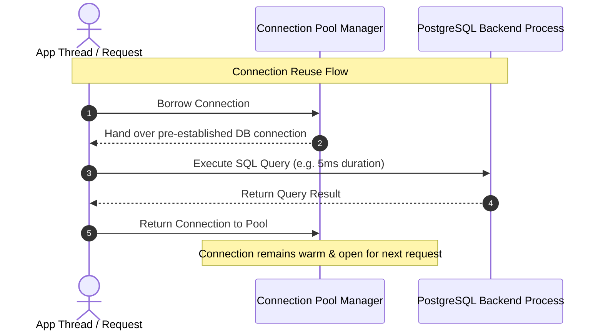
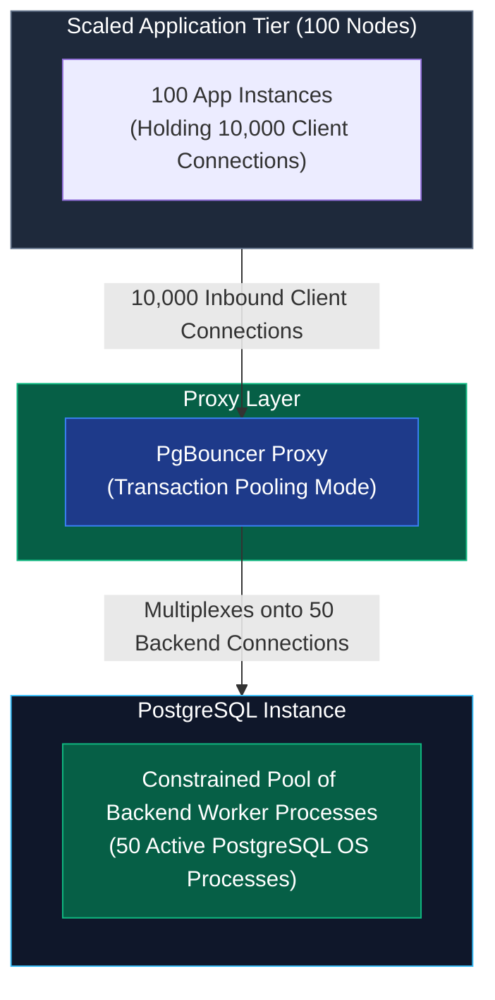
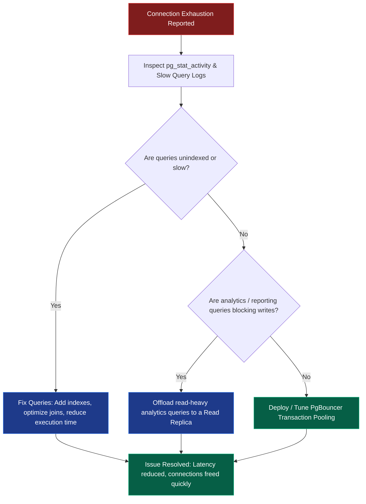

*Inspired by:*
- [Chai aur Code: Postgres Connection Pooling](https://www.youtube.com/watch?v=y3oAiv4hfIo)

When building backend services, one of the most common errors encountered under growing traffic is the infamous PostgreSQL error: `fatal: sorry, too many clients already`. 

For engineers working with Object-Relational Mappers (ORMs) or direct database drivers, the instinctive fix is often to increase the connection limit in application configuration or update PostgreSQL's `max_connections` parameter. While bumping the connection limit from 10 to 50 might temporarily solve the immediate issue, naively scaling connections to hundreds or thousands eventually degrades performance and can crash the database entirely.

Understanding why database connections cannot scale infinitely requires diving into PostgreSQL's internal process architecture, operating system resource constraints, and connection pooling techniques.

---

## The Max Connection Trap

When a backend application first hits a database connection error, increasing the pool size from 10 to 50 connections often resolves the issue. This creates a false impression: if increasing connection limits solved the problem once, raising it from 100 to 1,000 or 10,000 should solve connection exhaustion permanently.

This assumption fails because connections are not free. Adding more database connections does not increase the underlying physical hardware capacity of the server. Instead, it forces the exact same CPU, memory, and disk resources to manage a vastly larger amount of internal contention.

---

## PostgreSQL Architecture: Process-per-Connection

Unlike databases that handle incoming client connections using lightweight thread pools (such as MySQL or thread-per-request servers), PostgreSQL relies on a **process-per-connection** architecture.

When a client connects to PostgreSQL:
1. The main PostgreSQL supervisor process (`postmaster`) receives the TCP connection request.
2. `postmaster` forks an entire dedicated operating system process for that specific client connection.
3. Every dedicated process allocates its own private memory buffers, maintains CPU cache lines, manages network socket handles, and tracks transactional lock states.

Because backend processes are full operating system processes rather than lightweight thread entries, each open connection consumes significant host memory and CPU management overhead, even when idle.

---

## Mental Model: The Restaurant and Kitchen Analogy

To understand why adding connections without hardware upgrades degrades performance, consider a restaurant analogy.

Imagine a popular restaurant with **10 cooks in the kitchen** and **50 dining tables**.
- **The Cooks** represent the available physical CPU cores and execution units.
- **The Tables** represent active client connections.

If 500 customers arrive at once, setting up 450 extra tables in the dining area does not mean customers get fed faster. The 10 cooks in the kitchen remain the bottleneck. Placing 500 orders simultaneously in the kitchen causes chaos: cooks bump into each other, order tickets get mixed up, and preparation time for every single dish balloons.

Adding dining tables (connections) without increasing cooks (CPU/RAM hardware capacity) creates contention rather than higher output.

---

## CPU Contention, Context Switching, and Memory Risks

### CPU Contention and Context Switching Overhead

Operating systems schedule active processes across available CPU cores. If a server has an 8-core CPU, it can execute 8 hardware threads simultaneously.

When 200 backend process connections simultaneously submit active SQL queries to an 8-core CPU:
1. The OS kernel must continuously preempt running processes and perform context switches to give all 200 processes a time slice.
2. Constant context switching invalidates CPU L1/L2/L3 caches, forcing frequent RAM fetches.
3. The CPU spends more clock cycles managing process state transitions than actually executing database query logic.

As context switching overhead mounts, query latency spikes across p50, p90, and p99 metrics. In severe cases, extreme load causes OS kernel lockups or triggers process kills.

### Working Memory (`work_mem`) and Out-Of-Memory (OOM) Risks

PostgreSQL uses the `work_mem` configuration parameter to allocate memory for internal sort operations (`ORDER BY`), hash tables, and join nodes (`DISTINCT`, `JOIN`).

Crucially, `work_mem` is allocated **per query operation node**, not per connection. A single complex analytical query containing multiple joins and sort stages may allocate `work_mem` several times concurrently.

$$\text{Max Query Memory} = \text{Active Connections} \times \text{Query Operation Nodes} \times \text{work\_mem}$$

If `work_mem` is set to 64 MB and 100 concurrent connections run complex queries with 4 join/sort operations each, total memory usage can quickly exceed available system RAM, triggering the Linux kernel Out-Of-Memory (OOM) killer to forcibly terminate PostgreSQL processes.

---

## Concurrency vs. Throughput: Finding the Sweet Spot

Understanding database performance requires distinguishing between **concurrency** and **throughput**:
- **Concurrency**: The number of active queries executing simultaneously on the database engine.
- **Throughput**: The number of completed SQL queries returned successfully per second (Queries Per Second, QPS).

As active concurrency increases from zero, throughput initially rises linearly up to a critical **sweet spot**. Once concurrency exceeds the server's core execution limits, context switching, cache invalidation, and lock contention take over. Throughput drops sharply while latency balloons.

For example:
- **100 active connections** might produce an optimal throughput of **5,000 QPS** at 2 ms average latency.
- **1,000 active connections** on the same hardware can degrade throughput down to **500 QPS** while pushing average latency up to 500 ms.

---

## The Auto-Scaling Connection Explosion

Modern cloud platforms automatically scale application instances based on incoming HTTP traffic. Without centralized connection management, application auto-scaling can accidentally crash a healthy database.

Consider a service where each application container initializes a connection pool of 20 database connections:
1. Under normal operation with **10 application instances**, total connections to PostgreSQL equal $10 \times 20 = 200$. The database handles this load comfortably.
2. During a high-traffic event (such as a live broadcast or flash sale), the application layer auto-scales from **10 to 100 instances**.
3. Total database connections unintentionally explode from $200$ to $2,000$ ($100 \times 20$).

Without any database configuration changes, the backend fleet saturates PostgreSQL's process table, triggering context switching thrashing, connection timeouts, and cascading database failure.

---

## Connection Pooling as the Fix

To prevent connection explosion, applications must use **connection pooling** rather than opening and closing raw database connections per request.

### The Cab Fleet Analogy (Uber / Ola)

Instead of manufacturing a brand new vehicle every time a passenger requests a ride and discarding it afterward, rideshare services maintain a fixed fleet of vehicles cruising on the roads. When a ride finishes, the cab immediately becomes available for the next passenger.

Connection pooling works identically: application threads borrow an active, pre-established database connection from a pool, execute their SQL query, and immediately return the connection to the pool for reuse.

### Why Connection Pooling Works: Applying Little's Law

User interactions with web applications follow an asymmetric pattern:
- A user might spend 30 seconds reading a page or filling out a form.
- The underlying database query executed during that interaction takes only 10 milliseconds.

Because database queries execute in milliseconds, a tiny number of database connections can serve a massive user base.

Using **Little's Law** from queuing theory:

$$L = \lambda \times W$$

Where:
- $L$ = Average number of active connections needed
- $\lambda$ = Arrival rate (queries per second)
- $W$ = Average query execution latency (seconds)

If an application generates **2,000 queries per second** ($\lambda = 2000$) with an average query execution time of **10 milliseconds** ($W = 0.010\text{ s}$):

$$L = 2000 \times 0.010 = 20\text{ connections}$$

Only **20 active database connections** are required to handle 2,000 QPS cleanly.

### Back-Pressure: Protection via Queuing

Connection pooling introduces **back-pressure**. When 500 incoming application requests hit a pool configured with 100 connections:
- **100 queries** execute immediately on the database.
- **400 requests** wait briefly in a lightweight application-side queue outside the database.

Waiting briefly in memory outside the database keeps the database engine healthy, allowing queries to finish in fast, controlled batches rather than collapsing under server-wide context switching.

---

## Infrastructure Architecture: PgBouncer Deep Dive

While application-level connection pools (such as HikariCP or ORM internal pools) limit connections per app instance, scaling across multiple app nodes requires a dedicated database proxy layer. **PgBouncer** is the industry standard proxy for PostgreSQL connection multiplexing.

PgBouncer sits between application instances and PostgreSQL, accepting thousands of client connections from backend services while maintaining a small, fixed pool of actual connections to PostgreSQL.

### PgBouncer Pooling Modes

1. **Session Pooling**: PgBouncer assigns a server connection to the client for the entire duration of the client connection. Once the client disconnects, the server connection is returned to the pool.
2. **Transaction Pooling** *(Recommended for high scale)*: PgBouncer assigns a server connection to the client only for the duration of a transaction. As soon as a transaction executes `COMMIT` or `ROLLBACK`, the connection is freed and reassigned to another client immediately.
3. **Statement Pooling**: PgBouncer assigns a server connection for individual SQL statements. (Note: Statement pooling breaks multi-statement transactions and is rarely suitable).

By deploying PgBouncer in **transaction pooling mode**, thousands of application backend workers can safely interact with PostgreSQL while keeping the actual PostgreSQL backend process count locked at an optimal number (such as 50 or 100 processes).

---

## Diagnostic Workflow Before Modifying `max_connections`

Increasing `max_connections` directly in `postgresql.conf` should be a last resort. Before changing connection limits, follow this diagnostic workflow:

1. **Inspect Active State**: Query `pg_stat_activity` to identify connection states (`active`, `idle`, `idle in transaction`).
2. **Optimize Slow Queries**: Long-running queries hold connections open longer. Adding proper indexes or tuning execution plans reduces query duration, allowing connections to return to the pool faster.
3. **Offload Analytical Workloads**: Move heavy reporting, aggregation, and export queries away from the primary transactional node onto dedicated read replicas.
4. **Deploy Connection Proxying**: Position PgBouncer in transaction pooling mode between app services and the primary database.

---

## Golden Rules of Database Scaling

To maintain high throughput and low query latencies when scaling PostgreSQL:

1. **Smaller pools are almost always faster than larger pools**: Restricting pool size reduces OS context switching, CPU cache misses, and lock contention.
2. **Always test your workload under realistic concurrency**: Measure **p50**, **p90**, and **p99** query latencies using load testing tools before declaring an architecture production-ready.
3. **Maximize useful throughput, not connection count**: High connection counts are an overhead metric, not a performance achievement. Goal metrics should always focus on maximizing useful query throughput per second at acceptable latency thresholds.
