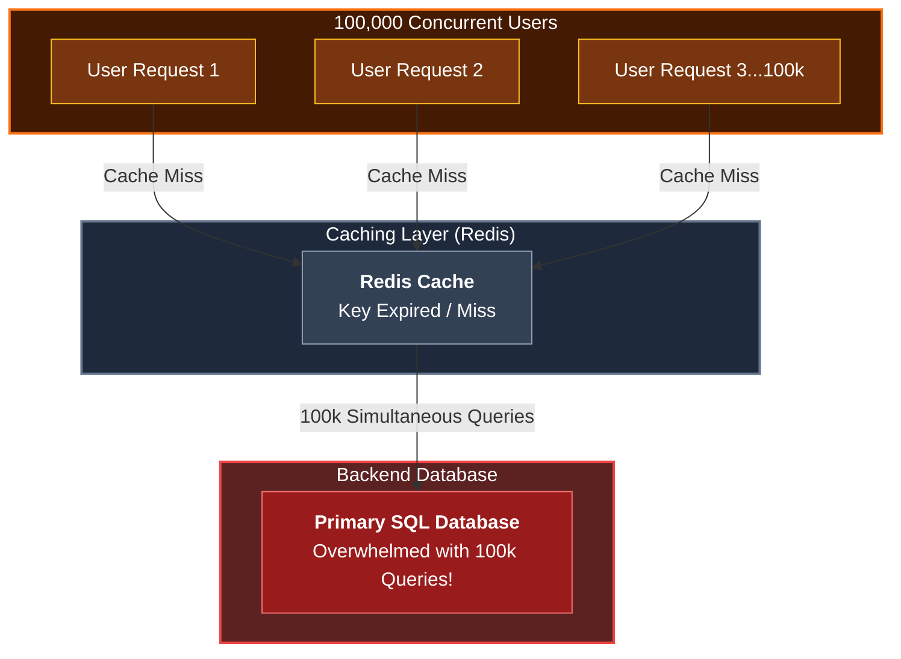
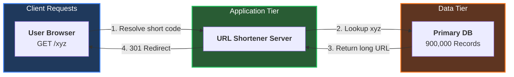
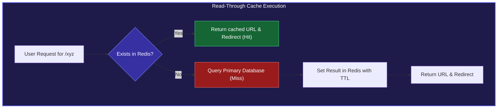
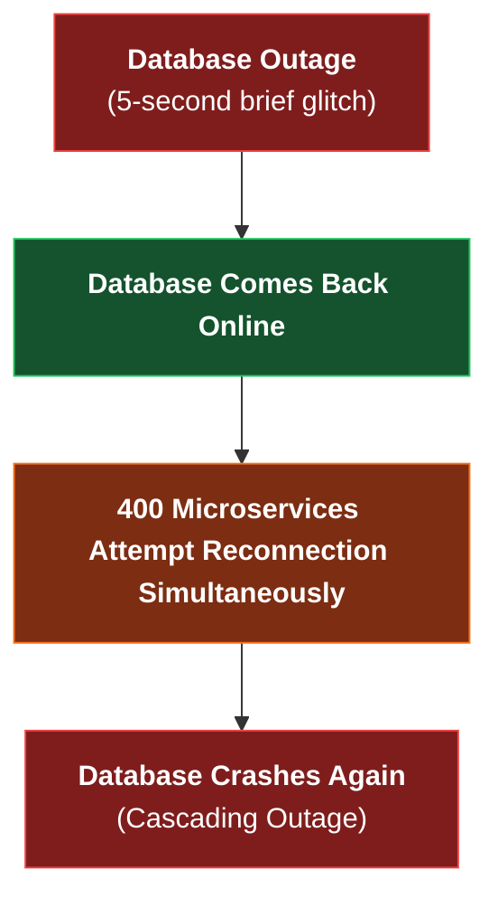
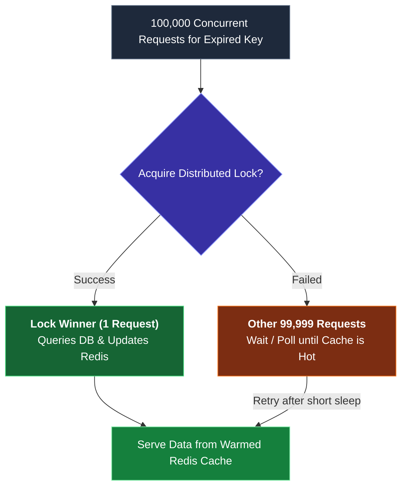

*Inspired by:* [YouTube](https://www.youtube.com/watch?v=EIAbTpz-vnw)

In large-scale system design interviews and production backend architectures, system performance bottlenecks do not always stem from missing database indexes or slow network bandwidth. Frequently, major outages occur due to sudden **concurrency spikes** where thousands of requests hit a backend resource at the exact same instant. This phenomenon is known as the **Thundering Herd Problem** or **Cache Stampede**.

In this post, we will explore what the Thundering Herd problem is, examine how it degrades system performance, analyze real-world system architecture examples like URL shorteners and microservice connection storms, and break down practical architectural solutions to prevent it.

---

## What is the Thundering Herd Problem?

The **Thundering Herd Problem** (also referred to as a **Cache Stampede**) is a performance-degrading phenomenon where a massive, synchronized surge of processes or user requests simultaneously hit a backend resource (such as a primary database, cache cluster, or microservice).



Picture a massive herd of bulls charging at a single narrow doorway all at once. The infrastructure gets overwhelmed instantly, leading to severe latency spikes, cascading service failures, and complete system outages.

---

## Real-World Example: Designing a URL Shortener Service

To understand how a Thundering Herd problem arises in practice, consider a URL Shortener service (similar to `bit.ly` or `short.co`).

### High-Level Architecture

When designing a URL shortener, you have two primary operations:
1. **Creation (POST):** A user submits a long URL (e.g. `https://example.com/very/long/path`) to generate a short code (e.g. `xyz`). The application server inserts this mapping into a database.
2. **Redirection (GET):** When users visit `https://short.co/xyz`, the application server looks up `xyz` in the database, retrieves the long URL, and returns a 301/302 HTTP redirect.



### The Read Bottleneck

As the system grows to store 900,000+ records, querying the primary database for every single click becomes a severe bottleneck. Even with database indexes, executing high-frequency lookups on millions of records increases CPU utilization and disk I/O, slowing down redirection latency. Because the primary goal of a URL shortener is lightning-fast redirection, reading directly from the database on every request is inefficient.

### Adding a Caching Layer (Read-Through Cache Pattern)

To optimize read latency, a memory cache (like Redis) is introduced. Instead of hitting the database directly, the application first checks Redis:



#### Application Pseudocode

```javascript
// Check cache first; if missing, query database and populate cache
if (cache.has(key)) {
  return cache.get(key); // Cache Hit
}

const data = db.find(key); // Cache Miss (Query DB)
cache.set(key, data);
return data;
```

This caching pattern reduces response times from 1-2 seconds down to milliseconds.

---

## Where the Race Condition Occurs: The Cache Stampede

The vulnerability in the code above appears when a **cache miss** occurs under high concurrency.

Imagine the cache key for a viral URL is empty (or has just expired), and **100,000 users** request `https://short.co/xyz` at the exact same millisecond:

1. All 100,000 request threads execute `redis.get('xyz')` simultaneously.
2. Because the key is missing or expired, all 100,000 threads experience a **Cache Miss**.
3. All 100,000 threads bypass the cache and fire 100,000 concurrent SQL queries to the primary database for the exact same short code.
4. The database is instantly overwhelmed by 100,000 simultaneous queries, causing CPU saturation, connection pool exhaustion, and server crashes.

If a single user had arrived just 1 second earlier, that single request would have queried the database, saved the result in Redis, and warmed the cache. The subsequent 99,999 requests would have hit Redis directly. However, because all 100,000 requests arrived simultaneously, the cache provided zero protection.

---

## Other Manifestations of Thundering Herd

The Thundering Herd problem extends beyond cache keys:

### 1. Service Reconnection Storms
Imagine an architecture with 400 microservices (Auth service, Notification service, Email service, Kafka workers) connected to a SQL database. If the database experiences a brief 5-second outage:
- All 400 microservices lose connection and queue up pending requests.
- The moment the database recovers and comes back online, all 400 microservices simultaneously attempt to create connection pools and execute queued queries at the exact same instant.
- This synchronized reconnection flood knocks the database right back down.



### 2. Scheduled Cron Jobs & Flash Sales
- **Synchronized Cron Jobs:** If dozens of application servers are configured with cron jobs running at the exact same timestamp (e.g. `0 14 * * *` for 2:00:00 PM), all servers execute heavy backend tasks simultaneously.
- **Flash Sales:** Millions of users clicking "Buy Now" at 12:00:00 PM when an e-commerce flash sale opens.

---

## Architectural Mitigation Strategies

Preventing the Thundering Herd problem requires breaking traffic synchronization or controlling database query execution during cache misses.

### 1. Distributed Mutex / Locking

Before querying the database on a cache miss, require the application thread to acquire a distributed lock (e.g. using Redis `SET key value NX PX 5000` or Redlock). Only the process that successfully acquires the lock is permitted to query the database and update the cache. Other processes wait or poll until the cache is populated.



#### Code Implementation

```javascript
// Check cache first
if (cache.has(key)) {
  return cache.get(key);
}

// Only ONE process acquires the lock to query the database
if (acquireLock(key)) {
  const data = db.find(key);
  cache.set(key, data);
  releaseLock(key);
  return data;
} else {
  // Other requests wait for cache to be updated
  waitUntilCacheUpdated();
  return cache.get(key);
}
```

### 2. Request Coalescing (Single In-Flight Executions)

Request coalescing merges duplicate concurrent requests arriving at an application instance into a single in-flight database query. If 1,000 requests for key `xyz` arrive at the same application server simultaneously, the server executes only 1 database query and shares the resulting Promise across all 1,000 callers.

### 3. Adding Jitter (Randomized Retry Intervals)

To prevent reconnection storms after a service outage, add **Jitter** (randomness) to retry delays instead of retrying at fixed intervals.

```text
Retry Interval = Base Backoff + Random(0, Max Jitter)
```

Instead of 400 microservices reconnecting at exactly 2.0 seconds, Jitter spreads retries across randomized windows (e.g. Service A retries at 1.2s, Service B at 3.7s, Service C at 2.1s), smoothing out the database load curve over time.

### 4. Stale-While-Revalidate (SWR)

With Stale-While-Revalidate, when a cache key expires, the application immediately serves the slightly stale cached value to incoming users while triggering a single background asynchronous worker to revalidate and update the cache key.

### 5. Background Pre-Warming & Probabilistic Early Refresh

Instead of letting high-traffic cache keys expire naturally and relying on user requests to trigger revalidation, background worker processes pre-warm and refresh cache keys before their TTL expires.

---

## Summary and Key Takeaways

* **The Thundering Herd Problem (Cache Stampede)**  
  A performance-degrading condition where a massive surge of concurrent requests simultaneously hits an uncached backend resource, overwhelming primary databases or servers.

* **Distributed Locking (Mutex)**  
  Acquires a temporary lock (such as Redis Redlock) on a cache miss so that only a single request queries the database while other requests wait for the cache to warm up.

* **Request Coalescing**  
  Hooks multiple concurrent in-flight requests on the same app server into a single shared database query promise, reducing duplicate queries.

* **Jitter (Randomized Backoffs)**  
  Adds random delay offsets to retry attempts during service recoveries, preventing 400+ microservices from overwhelming a recovering database at the exact same millisecond.

* **Stale-While-Revalidate (SWR) & Pre-Warming**  
  Serves slightly stale cache data immediately while updating the cache key asynchronously in the background before hard expiration.

### Mitigation Strategies at a Glance

<table>
  <thead>
    <tr>
      <th>Mitigation Strategy</th>
      <th>Problem Solved</th>
      <th>Key Mechanism</th>
    </tr>
  </thead>
  <tbody>
    <tr>
      <td><strong>Distributed Locking</strong></td>
      <td>Cache Stampedes on Expired Keys</td>
      <td>Restricts database lookups during cache misses to a single lock winner.</td>
    </tr>
    <tr>
      <td><strong>Request Coalescing</strong></td>
      <td>In-Memory Duplicate Requests</td>
      <td>Shares a single in-flight DB Promise across concurrent application threads.</td>
    </tr>
    <tr>
      <td><strong>Jitter / Randomized Backoff</strong></td>
      <td>Reconnection Storms & Outages</td>
      <td>Offsets retry timestamps to smooth out database connection spikes.</td>
    </tr>
    <tr>
      <td><strong>Stale-While-Revalidate</strong></td>
      <td>High-Traffic Content Expiration</td>
      <td>Serves stale cache content immediately while revalidating asynchronously in background.</td>
    </tr>
  </tbody>
</table>
